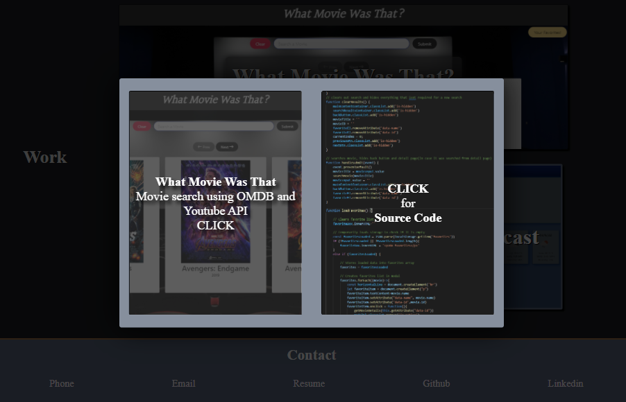

# Portfolio
This is my portfolio.  There is a navigation bar for navigating to the about section, the work section, and the contact section.  The work section has three sample projects that will be replaced with the projects I create during the bootcamp.

The project boxes have an image of a sample project that you can hover over to produce two boxes.  One box is a small image of the project that you can click on to visit the deployed sample project. The other box contains a brief summary of the project and a description of the technology used to create it.  You can click on this box to be taken to the Github repository for the project. This hover effect is disabled for smaller windows to make it easier to navigate on mobile devices.

The footer of the page contains contact information for my email, Github, and Linkedin page.

## Links
[Portfolio](https://bthalpin.github.io/Portfolio)

[What Movie Was That? - App](https://samif812.github.io/What-Movie-Was-That-/)

[What Movie Was That? - Code](https://github.com/SamiF812/What-Movie-Was-That-)

[Code Quiz - App](https://bthalpin.github.io/Code-Quiz/)

[CodeQuiz - Code](https://github.com/bthalpin/Code-Quiz)

[Weather Forecast - App](https://bthalpin.github.io/Weather-Forecast/)

[Weather Forecast - Code](https://github.com/bthalpin/Weather-Forecast)

## Media
The following image displays the full portfolio page:

This image displays the work section hover effect:
